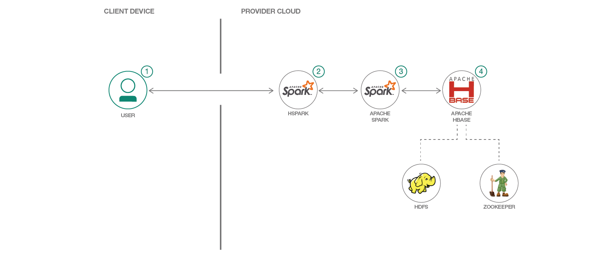

# Using Spark SQL to access NOSQL HBase Tables

Apache HBase is an open source, NOSQL distributed database which runs on top of the Hadoop Distributed File System (HDFS), and is well-suited for faster read/write operations on large datasets with high throughput and low input/output latency. But, unlike relational and traditional databases, HBase lacks support for SQL scripting, data types, etc., and requires the Java API to achieve the equivalent functionality.

This journey is intended to provide application developers familiar with SQL, the ability to access HBase data tables using the same SQL commands. You will quickly learn how to create and query the data tables by using Apache Spark SQL and the HSpark connector package. This allows you to take advantage of the significant performance gains from using HBase without having to learn the Java APIs required to traditionally access the HBase data tables.

When you have completed this journey, you will understand how to:

 - Install and configure [Apache Spark](https://spark.apache.org/) and [HSpark](https://github.com/bomeng/Heracles) connector.
 - Learn to create metadata for tables in [Apache HBase](https://hbase.apache.org/).
 - Write Spark SQL queries to retrieve HBase data for analysis.



## Flow

1. Set up the environment (Apache Spark, Apache HBase, and HSpark).
2. Create the tables using HSpark.
3. Load the data into the tables.
4. Query the data using HSpark Shell.

## Included Components:
 - [Apache Spark](https://spark.apache.org/): An open-source, fast and general-purpose cluster computing system.
 - [Apache HBase](https://hbase.apache.org/): A distribute key/value data store built to run on top of HDFS.
 - [HSpark](https://github.com/bomeng/Heracles): Provides access to HBase using SparkSQL.

There are also some core tools you will need to complete this journey. If you do not already have them installed, please refer to the corresponding documents for installation instructions. Ensure that the proper system environment variables are correctly set (such as `PATH`, `JAVA_HOME` and `MVN_HOME`).

 - [Apache Maven 3.5.0](https://maven.apache.org/): A build automation tool primarily used for Java projects.
 - [Java JDK 1.8.0_144](https://www.oracle.com/technetwork/java/javase/downloads/index.html): A software development environment used for developing Java applications.

# Watch the Video
[](https://www.youtube.com/watch?v=E1GPJMn0qF0)

# Steps

Perform the following steps:

1. [Install Apache Spark](#1-install-apache-spark)
2. [Install and run Apache HBase](#2-install-and-run-apache-hbase)
3. [Download and build HSpark](#3-download-and-build-hspark)
4. [Start the HSpark shell](#4-start-the-hspark-shell)
5. [Use HSpark to access TPC-DS data](#5-use-hspark-to-access-tpc-ds-data)

## 1. Install Apache Spark

HSpark relies on Apache Spark, thus you need to install Apache Spark first. Download Apache Spark 2.2.0 from the [downloads page](https://spark.apache.org/downloads.html).

You may also download the source codes from [Apache Spark GiHub](https://github.com/apache/spark) and build it using the 2.2 branch.

To set-up and configure Apache Spark, please refer to the [on-line users guide](https://spark.apache.org/docs/latest/).

In order to make HSpark work properly, you may need to set the `SPARK_HOME` environment variable to point to your installation directory:

```sh
$ export SPARK_HOME=<path_to_spark>
```

## 2. Install and run Apache HBase

Currently, HSpark works with Apache HBase 1.2.4. Go to the [downloads page](https://archive.apache.org/dist/hbase/1.2.4/) to install it.

HBase can be installed to run in 3 different modes – standalone, pseudo-distributed, and fully distributed.

For our simple demonstration of running HSpark in a single machine, we recommend you run it in pseudo-distributed mode. This mode runs HBase completely on a single host, but all daemons run as a separate process.

For reference, refer to this [guide](https://hbase.apache.org/book.html#quickstart) to review how to install and run in each of the modes.

Also properly set up the environment variable `HBASE_HOME` and add it to `PATH`.

```sh
$ cd $HBASE_HOME
$ ./bin/start-hbase.sh
```
To test that HBase is up and running, access the HBase Web UI at [http://localhost:16010](http://localhost:16010)

## 3. Download and build HSpark

Use git to clone `version 2.2.0` of the source code from github and set up an environment property `HSPARK_HOME`:

```sh
$ git clone https://github.com/bomeng/Heracles.git
$ export HSPARK_HOME=<path_to_hspark>
```

Configure the proper values in `hspark.properties` found in the `HSpark/conf` folder. Depending on your HBase running mode, you can leave the values as is, or modify them as specified in the comments found in the file.

Go to the root of the source tree and use Apache Maven to build the project:

```sh
$ cd $HSPARK_HOME
$ mvn -DskipTests clean install
```

In order to use the HSpark SQL shell, you will need to add the built HSpark jar to the HBASE classpath:

```sh
$ export HBASE_CLASSPATH=$HSPARK_HOME/target/hspark-2.2.0.jar
```

## 4. Start the HSpark shell

HSpark shell is a convenient tool for the developers or users to try HSpark quickly. It supports the basic SQL commands to create tables, import data and perform queries. After we have installed Spark, HBase and HSpark, now we can start the HSpark shell:

```sh
$ cd $HSPARK_HOME
$ ./bin/hbase-sql
```

## 5. Use HSpark to access TPC-DS data

[The TPC Benchmark™DS (TPC-DS)](http://www.tpc.org/tpcds/) is a decision support benchmark that models several generally applicable aspects of a decision support system, including queries and data maintenance. TPC-DS is the de-facto industry standard benchmark for measuring the performance of decision support solutions including, but not limited to, Big Data systems.

In order to demonstrate HSpark’s capability, we will use some of the TPC-DS schema to create the tables in HBase and then import the sample data into those tables. We can then use HSpark to do various queries against these tables.

### Schemas

We will take some tables from the TPC-DS definition. Here is the schema (the primary keys in each table are underlined):

[](doc/source/images/schema.png)

### Create the tables using script in the HSpark shell

Currently, HSpark supports several data types that are commonly used. For the TPC-DS schema, the data types can be mapped as the following:

| TPC-DS data type | HSpark data type |
| ------ | ------ |
| Identifier | Integer |
| Integer | Integer |
| Decimal(d, f) | Float or Double |
| Char(N) or Varchar(N) | String |
| Date | Long |

Please find the table creation commands in the [scripts](scripts) folder. There you will find 5 commands that you need to cut and paste into the HSpark Shell.

### Import data into the tables using script in the HSpark shell

HSpark supports bulk-load of data into the tables. The data can be defined in CSV files. By using the TPC-DS tool, you can generate the data at your preferred size.

HSpark can import CSV data files that you generate by using the TPC-DS tool. A sample CSV file(store_sales.txt) can be found in the [data](data) folder.

To import this sample CSV data file into the `store_sales` table, modify and enter the following command:

```sh
LOAD DATA LOCAL INPATH '<absolute_path_to_repo_dir>/data/store_sales.txt' INTO TABLE store_sales
```
*Note:* This command may fail with a `Mkdirs failed to create` error. See [Troubleshooting](#troubleshooting) section below.

### Query the tables using script in the HSpark shell

After importing the data into the tables, we can now query the tables using regular SQL queries; for example,

```sh
SELECT count(1) FROM store_sales
```

More query examples can be found in the [scripts](scripts) folder, along with expected output from each of the queries.

### Using HSpark programmatically

HSpark can also be used to programmatically create tables, import data and run queries. Visit the HSpack source code repository at [https://github.com/bomeng/Heracles](https://github.com/bomeng/Heracles/tree/master/src/test) for more details.

# Troubleshooting

* Error: `java.io.IOException: Mkdirs failed to create /user/<userid>/hbase-staging`

If you see this error while running the LOAD command, it means you need to create a temporary folder locally to allow hbase to store intermediate result.

> Solution: Create the *hbase-staging* directory that is required by hbase (using `mkdir` and `chmod` to create the directory manually).

* Error: `java.net.ConnectException: Connection refused`

If you see this error while running the command, it usually means HSpark cannot connect to HBase, either it is due to connection configuration issue, or HBase is not up and running.

> Solution: Make sure HBase is properly configured and is running. You can also use `jps` to check if it is running.

* Error: `org.apache.spark.sql.catalyst.parser.ParseException`

If you see this error while running any command, it means your command syntax is not correct.

> Solution: Make sure your command is just one single line and has the correct syntax, especially for the single quote, space, etc. Although some example scripts look like multi-line commands, they are actually just single-line commands.

# Links
* [Demo on Youtube](https://www.youtube.com/watch?v=E1GPJMn0qF0): Watch the video.
* [Performance](https://databricks.com/blog/2014/11/05/spark-officially-sets-a-new-record-in-large-scale-sorting.html): Get more information about Spark performance.
* [HBase performance](https://blog.cloudera.com/blog/2016/06/new-study-evaluating-apache-hbase-performance-on-modern-storage-media/): Learn more about HBase performance.
* [SparkPackages: HSpark](https://spark-packages.org/package/bomeng/HSpark): Learn more about the high-performance HBase Spark SQL engine.
* [BigSQL blog](https://developer.ibm.com/hadoop/2017/07/13/announcing-bigsql-5-0/): Read “Announcing Big SQL 5.0” for more information.

# Learn more
* **Data Analytics Code Patterns**: Enjoyed this Code Pattern? Check out our other [Data Analytics Code Patterns](https://developer.ibm.com/technologies/data-science/)
* **AI and Data Code Pattern Playlist**: Bookmark our [playlist](https://www.youtube.com/playlist?list=PLzUbsvIyrNfknNewObx5N7uGZ5FKH0Fde) with all of our Code Pattern videos
* **Data Science Experience**: Master the art of data science with IBM's [Data Science Experience](https://www.ibm.com/cloud/watson-studio)
* **Spark on IBM Cloud**: Need a Spark cluster? Create up to 30 Spark executors on IBM Cloud with our [Spark service](https://cloud.ibm.com/catalog/services/apache-spark)

# License
This code pattern is licensed under the Apache Software License, Version 2.  Separate third party code objects invoked within this code pattern are licensed by their respective providers pursuant to their own separate licenses. Contributions are subject to the [Developer Certificate of Origin, Version 1.1 (DCO)](https://developercertificate.org/) and the [Apache Software License, Version 2](https://www.apache.org/licenses/LICENSE-2.0.txt).

[Apache Software License (ASL) FAQ](https://www.apache.org/foundation/license-faq.html#WhatDoesItMEAN)
